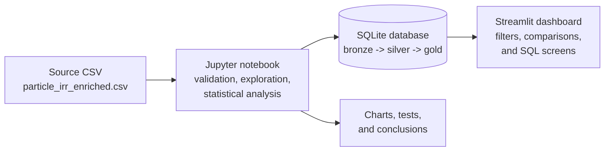

# Particle contamination: from signal to action

Three manufacturing stations report inconsistent particle-contamination results. The question is not simply which station has the highest average. The investigation needs to separate station patterns from operator, shift, product-line, particle-type, and particle-size effects, then understand how the particle metric relates to IRR.

This project follows that question from raw measurements to an interactive engineering dashboard.

## Follow the investigation

### 1. Start with the evidence

The Jupyter notebook loads the source CSV, checks data quality, structures the data in SQLite, explores distributions, and tests the main hypotheses. It keeps the original sample-level observations available while building summary tables for comparisons and dashboard use.

### 2. Find where to look closer

ICT40 has the highest mean particle metric in this dataset: 39.36, compared with 30.42 at AOI20 and 24.49 at SUB30. The station ANOVA and Tukey comparisons support meaningful differences between all three stations. Particle metric is also strongly associated with IRR (Pearson r = 0.852; Spearman rho = 0.846).

In the adjusted model, station, operator, shift, product line, particle type, and particle size remain statistically associated with particle metric. Together, these findings make ICT40 a sensible priority for engineering investigation, while the other recorded factors remain important context.

### 3. Turn the analysis into a working view

The Streamlit dashboard lets users filter the sample-level data and inspect particle-size distributions, station comparisons, statistical results, and SQL-based risk screens.

## Screenshots

**Notebook analysis**


## Data architecture



The notebook is the transformation and analysis workflow. It reads the CSV, creates the bronze and silver layers, calculates gold summaries and statistical outputs, and writes them to `particles_irr_analysis.db`. The dashboard reads that database; it does not independently rebuild the analysis.

## Reproduce the project

Use Python 3.10 or later. From the project directory, install the dependencies:

```bash
python -m pip install -r requirements.txt
```

Run all cells in `01_Particles_IRR.ipynb` from top to bottom to recreate the SQLite database, then launch the dashboard:

```bash
streamlit run particles_irr_streamlit.py
```

Keep the CSV, notebook, SQLite database, and Streamlit app in the same project directory.

## Read the results carefully

These are observational data. Statistical significance and adjusted regression identify associations, not physical causes. The source CSV contains no real production timestamps; the notebook's clearly labeled temporal sequence is a synthetic proxy derived from sample order, included only to demonstrate SQL window functions. Validating the suspected process mechanisms requires better production context and controlled follow-up.

## Project files

- `01_Particles_IRR.ipynb` — complete analysis and narrative.
- `particle_irr_enriched.csv` — source dataset.
- `particles_irr_analysis.db` — SQLite analytical database.
- `particles_irr_streamlit.py` — interactive dashboard.
- `requirements.txt` — Python dependencies.
- `screenshots/` — the notebook capture used above.